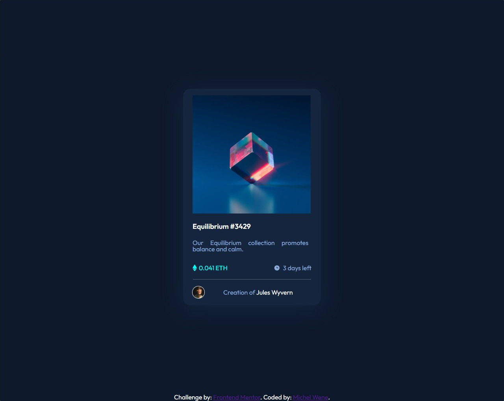
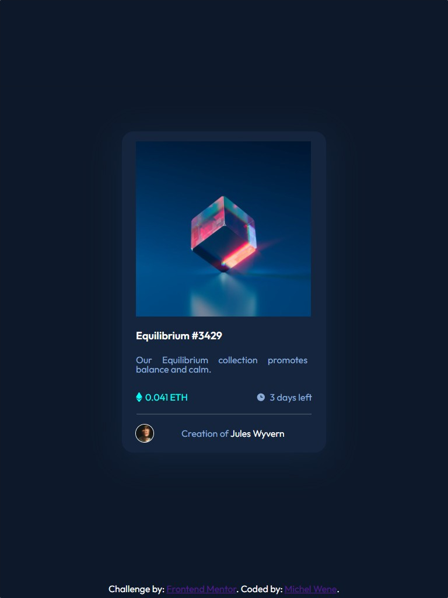
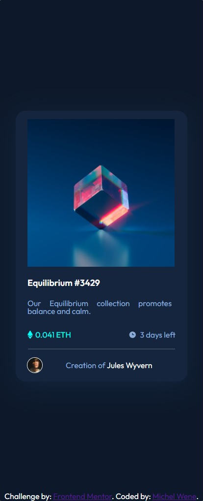

# Frontend Mentor - Stats preview card component

Esta é uma solução para o [NFT preview card component](https://www.frontendmentor.io/challenges/nft-preview-card-component-SbdUL_w0U). Os desafios do Frontend Mentor ajudam você a melhorar suas habilidades de codificação ao construir projetos realistas.

## Resumo de conteúdos

- [Visão Geral](#Visão-Geral)
  - [O desafio](#O-desafio)
  - [Captura de tela](#Captura-de-tela)
  - [Links](#Links)
- [Meu processo](#Meu-processo)
  - [Construído com](#Constrído-com)
  - [O que eu aprendi](#O-que-eu-aprendi)
  - [Continuação dos desenvolvimentos](#Continuação-dos-desenvolvimentos)
  - [Recursos utilizados](#Recursos-utilizados)
- [Autor](#Autor)

## Visão Geral.

### O desafio

Os usuários devem ser capazes de:

- Veja estados de foco para elementos interativos.
- dois efeitos de fundo integrados.
- Criação de um cartão de informações.
- Observar um design responsivo.
- Efeito de sombra na figura.
- Efeito de clique na figura do nft, título e nome do criador.

### Captura de tela

- Desktop
<p  align="center" >

</p>

- Tablet
<p  align="center" >
  
</p>

- Mobile
<p  align="center" >
  
</p>

- Gif
<p  align="center" >
  
</p>
### Links

- Solution URL: [https://github.com/michelwene/nft-preview-card-component](https://github.com/michelwene/nft-preview-card-component)
- Live Site URL: [https://michelwene.github.io/stats-preview-card/](https://michelwene.github.io/stats-preview-card/)

## Meu processo

### Construído com

- HTML5
- CSS3
- Flexbox
- Design responsivo
- EMMET

### O que eu aprendi

```html
<h1>Algum código HTML de que me orgulho</h1>
<div class="card">
  <div class="thumbnail">
    
    <div class="overlay"></div>
  </div>
  <!-- esta é a parte responsavel por realizar a possibilidade da criação do efeito do active -->
</div>
```

```css
.Orgulho-deste-css {
.thumbnail {
  position: relative;
  float: left;
  width: 50%;
}
.thumbnail:hover{
    cursor: pointer;
}

.nft {
  opacity: 1;
  display: block;
  width: 300px;
  height: 300px;
  height: auto;
  transition: 0.5s ease;
  backface-visibility: hidden;
  margin-left: -4em;
}

.overlay {
  width: 300px;
  height: 300px;
  transition: 0.5s ease;
  opacity: 0;
  position: absolute;
  top: 50%;
  left: 50%;
  transform: translate(-50%, -50%);

  background-image: url(../images/icon-view.svg);
  background-repeat: no-repeat;
  background-size: 20%;
  background-position: center;
  background-color: hsl(178, 100%, 50%);
}

.thumbnail:active .nft {
  opacity: 0.8;
}

.thumbnail:active .overlay {
  opacity: 1;
  opacity: 0.6;
}

/*Este css diz respeito ao efeito de "active" quando eu clico na imagem ela altera de a cor do nft(da imagem) e aparece este ícone de "View", tive que criar uma div Pai e duas div filhas, para que eu conseguisse sobrepor o efeito de "Olho" que era uma imagem svg que apareceria após eu clicar na imagem.*/

.avatar {
  max-width: 100%;
  height: auto;
  width: auto;
  border: 1px solid white;
  border-radius: 50%;
}
/* este css também foi importante pois me ensinou que eu poderia fazer uma imagem ficar redonda, eu apenas coloquei o border-radius e ficou da forma que eu precisava*/
```

### Continuação dos desenvolvimentos

Pretendo continuar fazendo projetos do FrontendMentor, para melhorar meu HTML, CSS, JavaScript.

### Recursos utilizados

- [CSS tricks](https://css-tricks.com/snippets/css/a-guide-to-flexbox/) - Este site me ajudou muito na parte de posicionamento dos elementos, pois a maior parte dos elementos foram posicionados utilizando flexbox.
- [W3schools](https://www.w3schools.com/css/default.asp) - Este site me ajuda muito nas minhas dúvidas sobre CSS e HTML
- [StackOverflow](https://stackoverflow.com/) - consultei este site principalmente para achar alguma solução de como colocar dois backgrounds e um sobrepor o outro.

## Autor

- Frontend Mentor - [@michelwene](https://www.frontendmentor.io/profile/michelwene)
- Linkedin - [@michelwene](https://www.linkedin.com/in/michelwene/)
